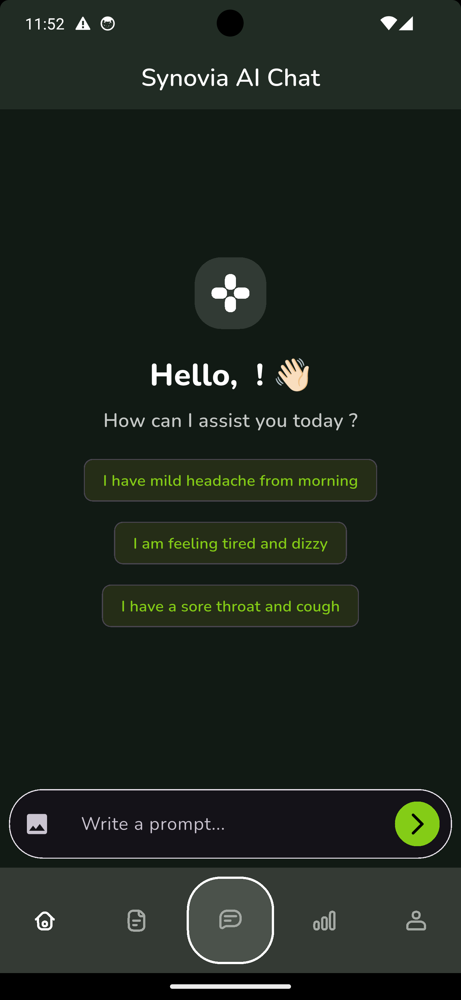
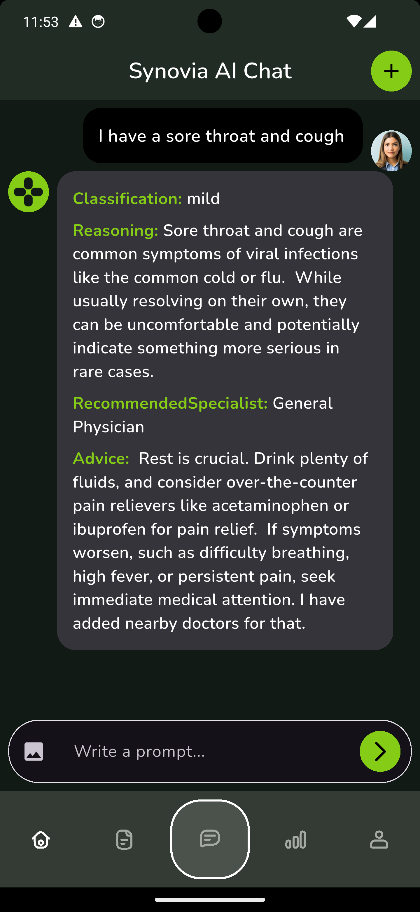
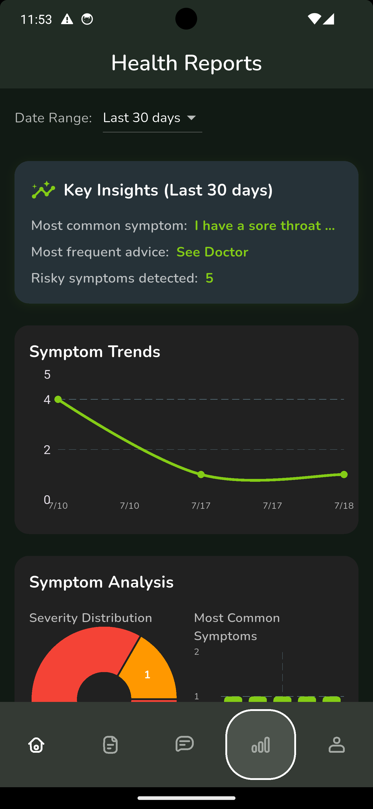
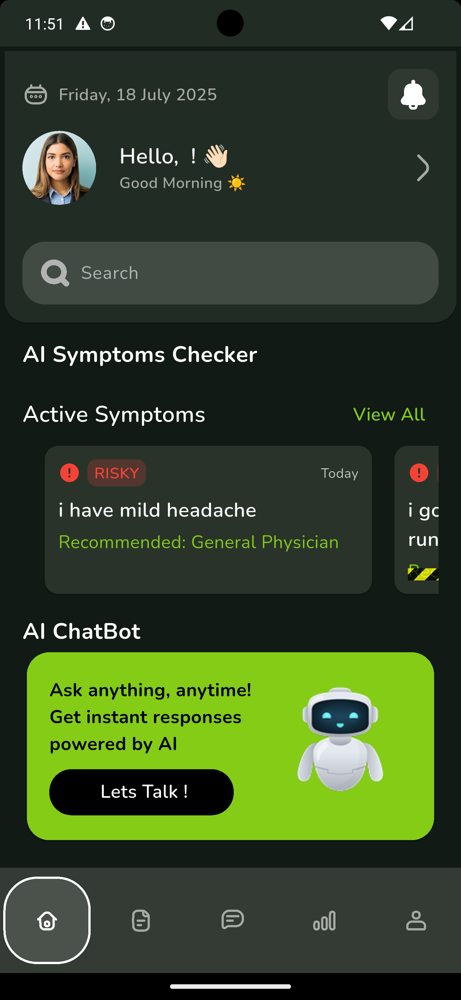
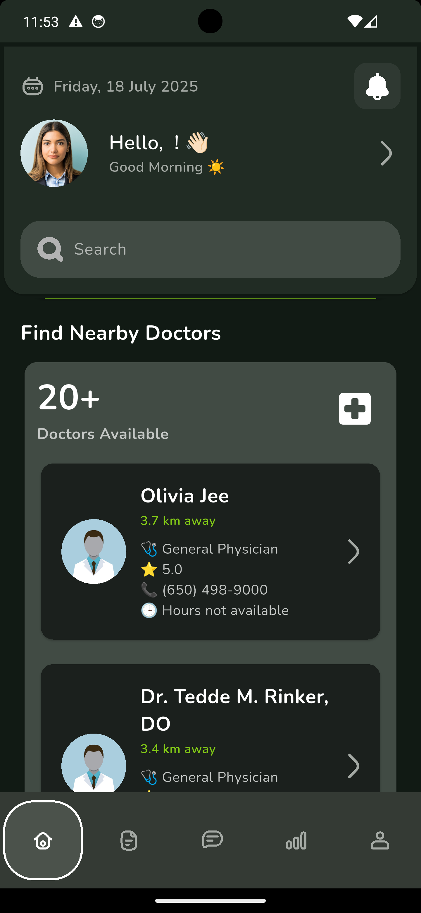
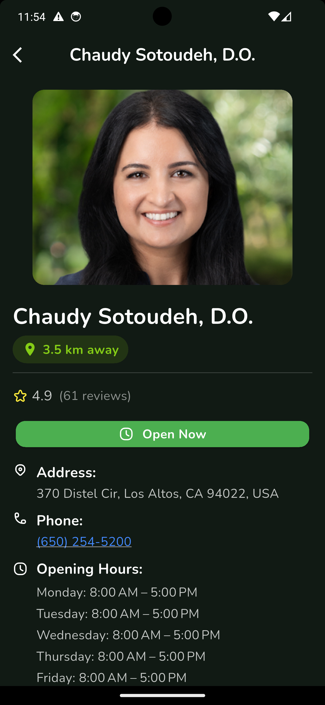
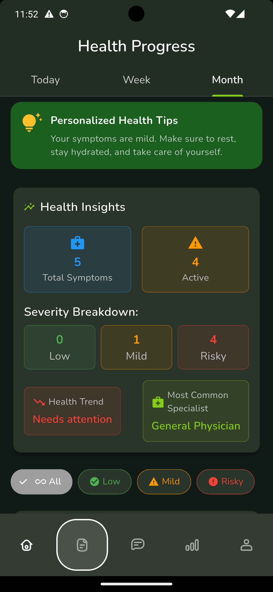

# 🧠 Synovia AI — Your Smart Telehealth Companion

**Synovia AI** is an AI-powered telehealth mobile application built using **Flutter**, **Firebase**, and **Google's Gemini AI**. It helps users assess symptoms, track health conditions, and receive personalized AI-driven health insights—all from the comfort of their smartphones.
### 🌐 Landing Page(https://synovia-landing-page.vercel.app/)
### ▶️ Demo video(https://youtube.com/shorts/ee1Y5Ld0jF0?feature=share)
- 📩 APK Link [Google Drive](https://drive.google.com/file/d/1C0FzwwcENG5JpJaXoUBoi_33ilL8wApv/view?usp=sharing)
---

## 🚀 Features

- 🔍 **AI Symptom Analysis**: Get instant responses and insights using Gemini-powered AI chat.
- 📈 **Health Tracker**: View and monitor symptom severity trends over time.
- 🗺️ **Nearby Doctor Finder**: Access a curated list of doctors near your location (coming soon).
- 🧠 **Personalized Responses**: Tailored recommendations based on symptom data and chat history.
- 💬 **Conversational UI**: Clean, chat-first design for an intuitive user experience.
- 🗂️ **Secure & Fast**: Built using Firebase Auth, Firestore, and serverless backend functions.

---

## 📱 Screenshots

| Symptom Chat | Health Insight | AI Response | Doctor Finder |
| ------------ | -------------- | ----------- | ------------- |

<p float="left">
  
  
  
</p>

<p float="left">
  
  
  
  
</p>

---

## 🧰 Tech Stack

- **Frontend**: Flutter (Dart)
- **Backend**: Firebase Functions (Node.js), Firestore, Firebase Auth
- **AI Model**: Gemini Pro (Google AI)
- **State Management**: Provider
- **Storage**: Hive (Local), Firebase Storage (Cloud)
- **Maps & Location**: Google Maps API
- **Analytics & Crash Reporting**: Firebase Analytics + Crashlytics

---

## 📂 Project Structure

lib/
├── main.dart
├── config/
├── core/
├── features/
├── utils/
functions/ # Firebase Cloud Functions (Node.js)
assets/ # Images, icons, illustrations

---

## 💡 How it Works

1. User signs in securely via Firebase Auth.
2. User inputs symptoms through chat UI.
3. Gemini AI model analyzes symptoms and generates insights.
4. Responses are stored locally in Hive and backed up in Firestore.
5. Health severity trends are visualized.
6. (Upcoming) Doctor list is fetched based on location & condition.

---

# 🚧 Roadmap

- [x] MVP with AI chatbot & health tracker
- [x] Firestore + Hive integration
- [x] Firebase Auth & onboarding
- [x] Nearby doctor suggestions (location-based)
- [x] Disease precautions integration
- [x] Landing Page with waitlist + app demo
- [ ] Launch on Google Play Store
- [ ] iOS build & deployment

---

## 🛠️ Run Locally

```bash
git clone https://github.com/madhurchouhan7/synovia_ai_telehealth_app.git
cd synovia_ai_telehealth_app
flutter pub get
flutter run
```

---

## 🌐 Live Demo

- 🚀 **Coming soon on Google Play Store**
- 📩 Sign up for early access: [synovia.health](https://synovia.health) _(Launching soon!)_

---

## 🙋‍♂️ Author

- Built with ❤️ by [Madhur Chouhan](https://www.linkedin.com/in/madhur-chouhan07)
- 📬 Reach out: madhurchouhan7@gmail.com

## 🤝 Contributing

Pull requests are welcome! For major changes, please open an issue first.
Let's make digital healthcare smarter — together!
